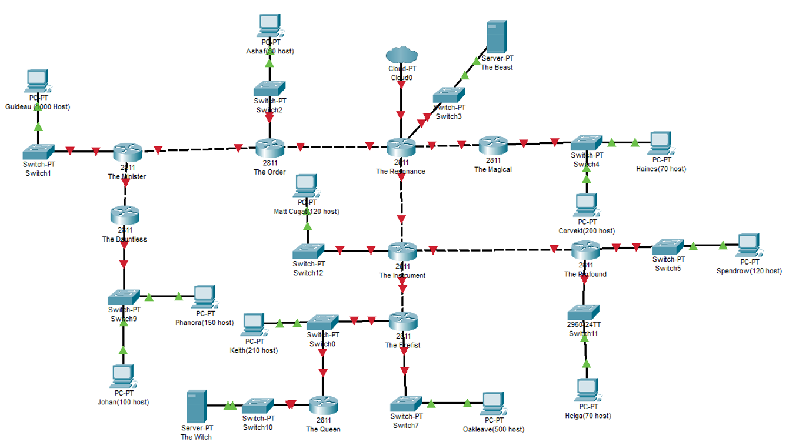
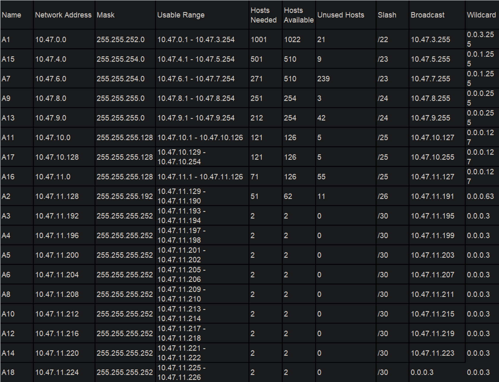

# Jarkom-Modul-4-ITB05-2022
Kelompok ITB05

1. M.Fernando N.Sibarani (5027201015)
2. Richard Nicolas (5027201021)
3. Muhammad Ihsanul Afkar (5027201024)

# Daftar Isi
* [Topologi](#Topologi)
* [VLSM](#VLSM) 
* [CIDR](#CIDR) 

# Topologi

# VLSM
Untuk topologi VLSM, kami menggunakan **Cisco Packet Tracer** dalam pembuatan topologi
Berikut ini adalah topologi pada CPT

Berikut ini adalah tabel VLSM yang kami lakukan

# CIDR